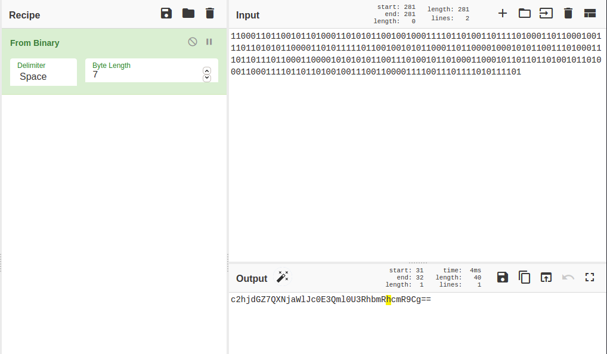

# Space Heroes CTF 2022 - Mysterious Broadcast (web)

The challenge provides us with a link.


Clicking onto the link brings us to a HTML page with a tilde character "~". We also notice that we are redirected to `/seq/ff626bbe-aa8b-4950-81d8-d3bf2d47d31e`.


If we refresh the page, we see that the HTML page now contains a "1".


Refreshing a few more times, we see that there is a sequence of "0"s and "1"s. I wrote a [python script](./solve.py) to scrape the sequence, terminating when we see another "~".

```python
import requests

url = "http://173.230.134.127"

response = requests.get(url)
seq_url = response.url

seq_response = requests.get(seq_url)

message = []

while seq_response.text != '~':
	bit = seq_response.text
	message.append(bit)
	seq_response = requests.get(seq_url)

print("".join(message))
```


Putting this binary sequence into Cyberchef, we get a base64 encoded string **if we set the byte length to 7**.


Decoding this string then gives us the flag.


> shctf{AsciiIsA7BitStandard}